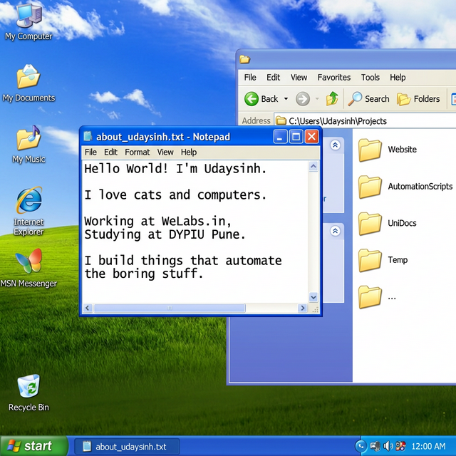

<!-- ╔══════════════════════════════════════════════════════╗ -->
<!-- ║          W I N D O W S   X P   D E S K T O P        ║ -->
<!-- ║              Udaysinh's GitHub Profile               ║ -->
<!-- ╚══════════════════════════════════════════════════════╝ -->

<div align="center">

<picture>
  
</picture>

</div>

<br />

<!-- ═══════ INTERACTIVE START MENU ═══════ -->

<details>
<summary>

&nbsp; <b>All Programs</b> — Skills &amp; Technologies
</summary>

<br />


</details>

<details>
<summary>

&nbsp; <b>Control Panel</b> — GitHub Stats
</summary>

<br />


</details>

<details>
<summary>

&nbsp; <b>Network Connections</b> — Socials
</summary>

<br />

<table>
<tr>
<td align="center" width="150"><a href="https://udaysinh.me"><br /><b>udaysinh.me</b></a></td>
<td align="center" width="150"><a href="https://twitter.com/udaysinh_me"><br /><b>@udaysinh_me</b></a></td>
<td align="center" width="150"><a href="https://instagram.com/udaysinh.me"><br /><b>Instagram</b></a></td>
<td align="center" width="150"><a href="https://sptfy.com/Udaysinh"><br /><b>Spotify</b></a></td>
</tr>
</table>

</details>

<details>
<summary>

&nbsp; <b>Run...</b>
</summary>

<br />

```bash
C:\Users\Visitor> git clone https://github.com/udaysinh-git/udaysinh-git.git
Cloning into 'udaysinh-git'...
remote: Total 42 (delta 0), reused 42 (delta 0)
Receiving objects: 100% (42/42), done.

C:\Users\Visitor> echo "Thanks for stopping by! :)"
"Thanks for stopping by! :)"
```

</details>

<br />

<div align="center">
<sub>

*Windows XP Professional — Build 2600.xpsp_sp3 — © Udaysinh 2025*  
 made with love, cats, and a suspicious amount of nostalgia

</sub>
</div>
